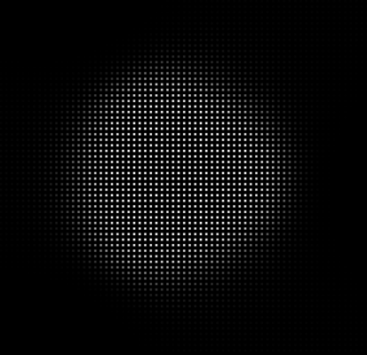

# Basic neuronal network

This project contains my first attempts to build a neuronal network with multiple layers and backpropagation from
scratch (without tensorflow or similar).
In this example the algorithm learns to draw a unity circle.

